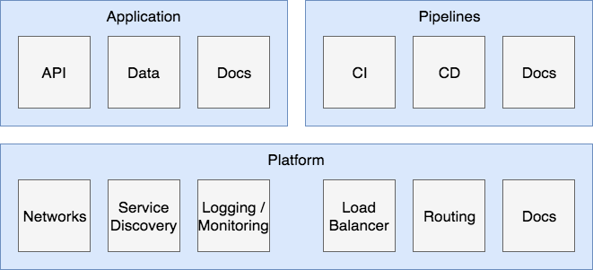
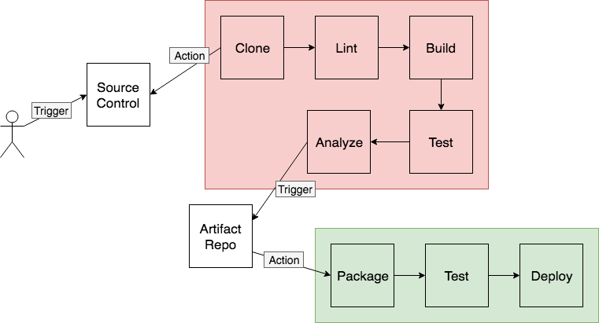

# Microservices Design

### Introduction: 

1. All services are configured programmatically by an API.
1. Events are the driving force ([event-driven](https://martinfowler.com/articles/201701-event-driven.html), [pub/sub model](https://en.wikipedia.org/wiki/Publish%E2%80%93subscribe_pattern), trigger/action)
1. Documentation is a first-class citizen.
1. Live and die with [12-factor](https://12factor.net/)
1. Services should have a single purpose (do one thing and do it well), be loosely coupled (know little about each other), and have high cohesion (encapsulates all related functionality and data together).

### Major Parts:

1. Application
1. Pipelines
1. Platform

## Application

Contains live services.

### Major Parts:

1. APIs
1. Storage
1. Docs

### APIs

1. Powered by web frameworks (Java/Spring Boot, Python/Flask, Node/Express etc.) 
1. Languages and frameworks don't matter as much as solid API contracts.
1. Single Responsibility.
1. [12 Factor](https://12factor.net/)
1. Immutability has to be considered.
1. Documentation is key - Swagger / OpenAPI spec.
1. Handle auth. Manage  API Gateway.

### Storage

Tools:

1. Databases (MongoDB, Postgres, Redis)
1. Task Queues
1. Message Brokers (RabbitMQ, Kafka)

Issues:

1. Storage is a _hard_ problem.
1. Containers are ephemeral, data is not.
1. Do you have a database per service or a shared database?
1. Disaster recovery? Testing?

## Platform

### Major Parts:

1. Software defined networks
1. Service discovery
1. Health checks (side cars approach)
1. Logging
1. Monitoring
1. Load balancing
1. Path-based routing
1. Circuit breaking

### Tools

1. Kubernetes
1. Docker Swarm
1. Mesos
1. Nomad
1. Fully-managed: EKS, GKE, ECS
1. [Ubuntus MAAS](https://www.ubuntu.com/server/maas) (metal as a service)
1. [OpenStack](https://www.openstack.org/)

## Pipelines

### Continuos Integration

Triggers:

1. Commit to source repo, build and test project. (automation)

### Tools

1. Github, GitLab, Git
1. Jenkins, Travis, Circle
1. AWS, GCP, Azure
1. Docker Repos
1. Linters, static code analysis

### Continuous Delivery

Triggers:

1. On successful build, deploy

### Tools

1. Shell scripts
1. Fabric (shell scripts on steroids)
1. **Terraform** templates
1. **AWS** (CodeDeploy, CodePipeline, CloudFormation), GCP, Azure
1. Concourse
1. [Spinnaker](https://www.spinnaker.io/)
1. Old Tools (Ansible, Chef, Puppet)

